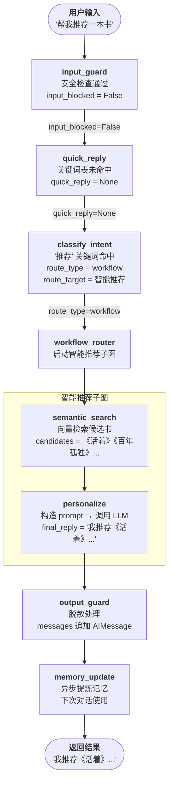
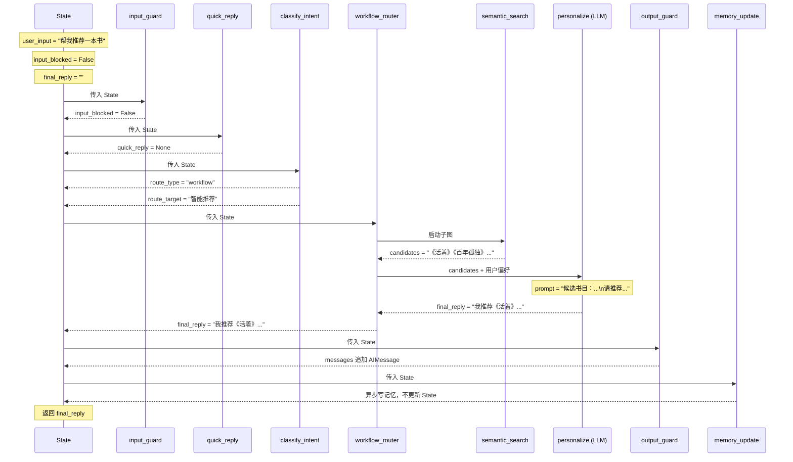

# "帮我推荐一本书" 完整执行追踪

## 主图流转



---

## State 逐步变化



---

## personalize 节点的 Prompt 构造

这是整条链路唯一调用 LLM 的地方（`workflows/recommend.py:51`）：

```
候选书目：
1. 《活着》余华 ...
2. 《百年孤独》马尔克斯 ...
3. ...

用户偏好：（从长期记忆 / RAG 检索，第一次为空）

请从候选中选出最符合用户偏好的 1-2 本，给出推荐理由。用中文回复。
```

LLM 返回推荐文本 → 写入 `final_reply` → 沿图传回主图 → 打印给用户。

---

## 各节点职责一览

| 节点 | 是否调用 LLM | 做什么 |
|------|------------|--------|
| `input_guard` | 否 | 正则检测注入、超长输入 |
| `quick_reply` | 否 | 字典精确匹配问候语 |
| `classify_intent` | 否（关键词命中）/ 是（兜底） | 决定走工作流还是专家链 |
| `semantic_search` | 否 | 向量数据库检索候选书 |
| `personalize` | **是** | 构造 prompt，调 LLM 生成推荐 |
| `output_guard` | 否 | 脱敏，追加消息历史 |
| `memory_update` | 是（异步） | 提炼本轮对话为长期记忆 |
