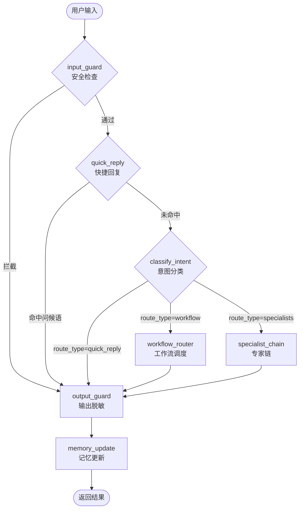
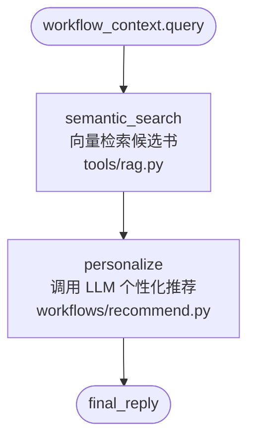
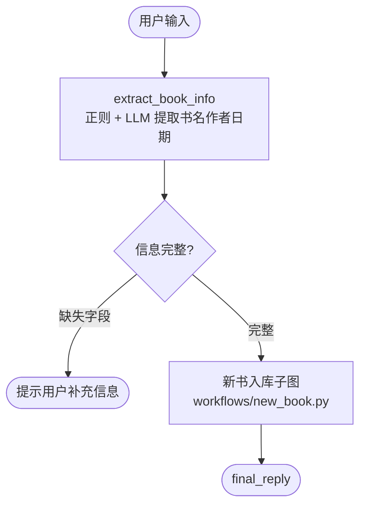
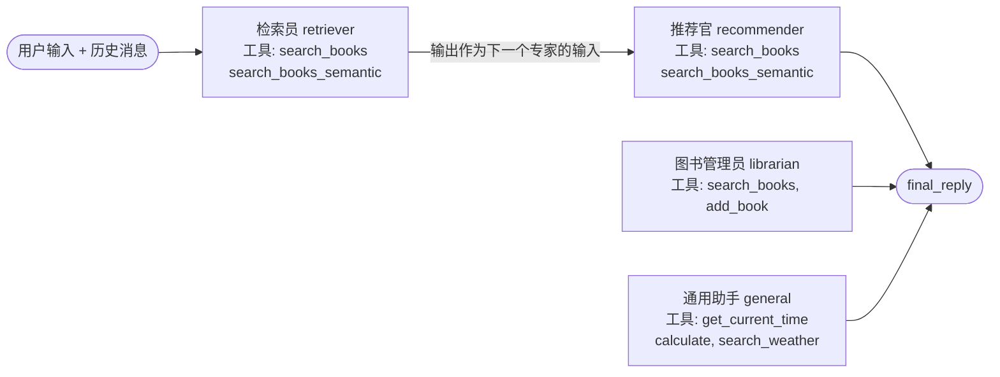
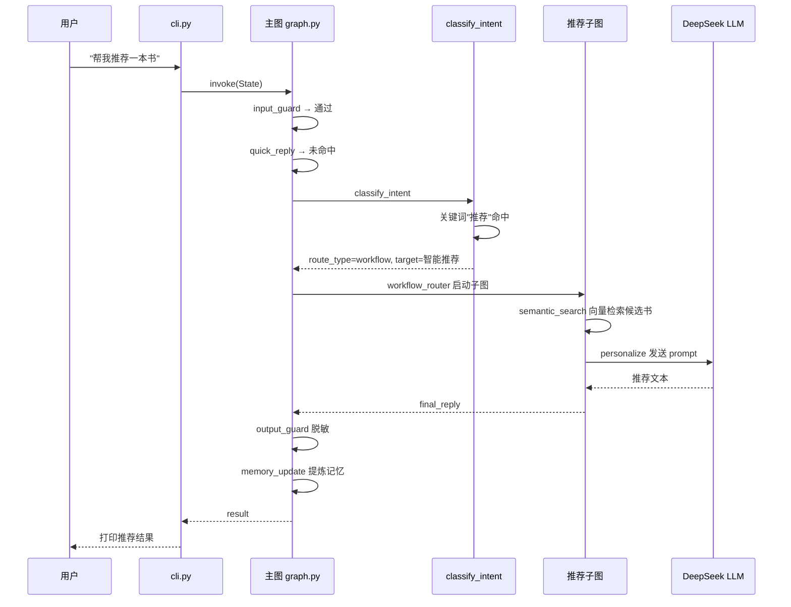

# Book Agent 流程图

## 主图

## 智能推荐子图

> 当 `classify_intent` 识别到"推荐"意图时，`workflow_router` 内部调用此子图。

## 新书入库子图

## 专家链

> 当 `classify_intent` 路由到 `specialists` 时，`specialist_chain` 顺序调用专家。

## 一次完整请求的数据流（以"帮我推荐一本书"为例）

